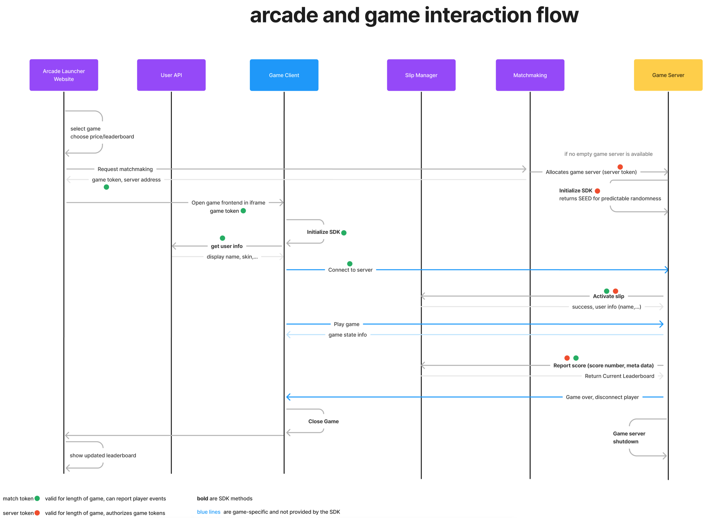

# Ultimate Arcade Unity Game SDK

## About

This is the Unity SDK for integrating games (servers and frontends) into the Ultimate Arcade.

The following diagram shows how the SDK is expected to be used, both on the client side (blue) and on the server side (yellow).

There are several tokens (which are just random strings for all that a user of the SDK has to care) which prove to
other parts of the system, what actions can be performed.

* The User Token gets passed from the Arcade Launcher to the game's website where it has to be passed into the SDK
* The Game Token is returned as a result from matchmaking and grants permission to play exactly once on a specific server
* The Server Token is handled transparently by the and is just listed for completeness. It ensure server and game token match up. 

## Installation

### Using Git

- In the Unity Editor go to `Window > Package Manager`
- Click the + at the top left of the Package Manager window
- Select `Add package from git URL...`
- Paste the following URL `https://github.com/UltimateTournament/ArcadeUnitySDK.git` and click `Add`

## Configuration

TODO

## Updating

If you installed the SDK using the Git URL you can simply open the package manager and re-paste the Git URL.
This should force a download of the latest code.
